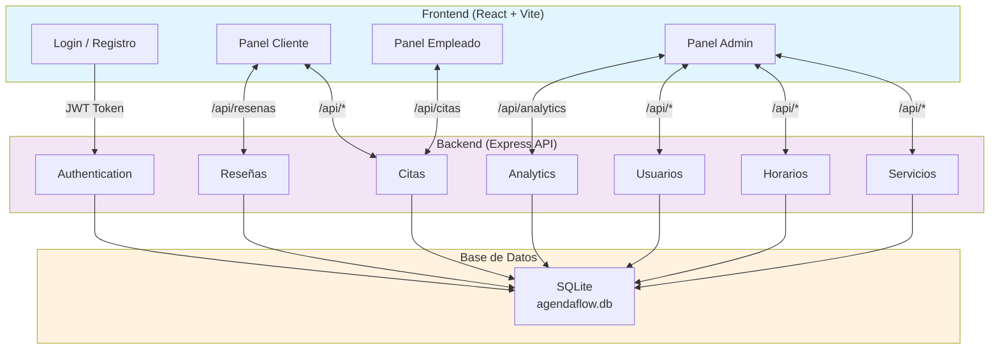
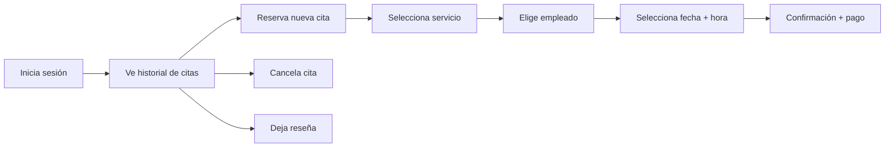
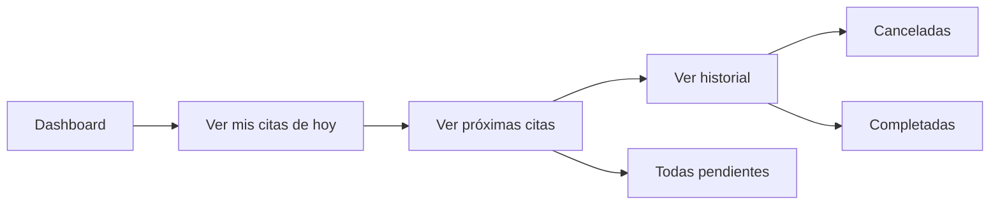
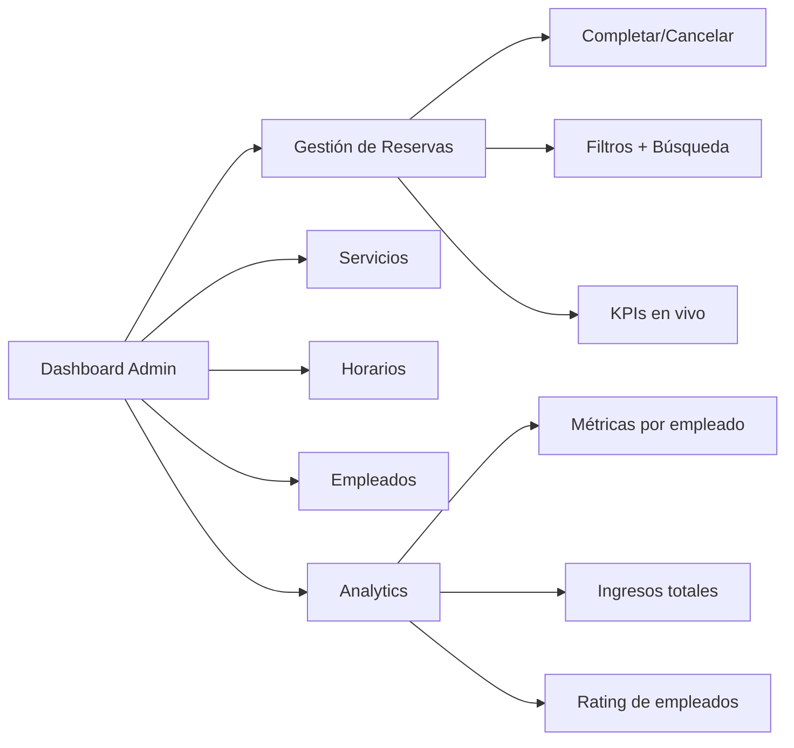
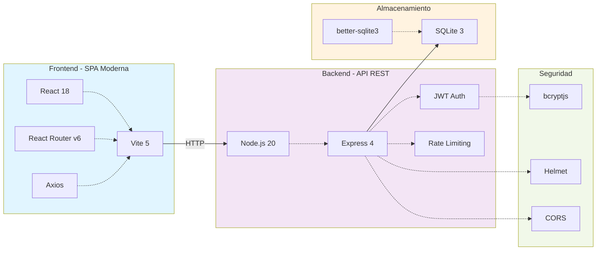
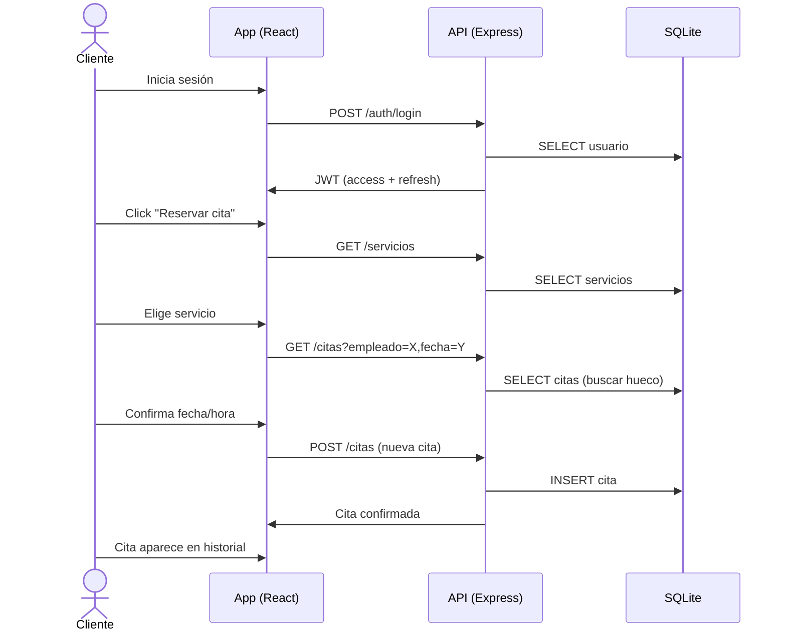

# AgendaFlow — Sistema de Gestión de Citas

> **La solución all-in-one para negocios de servicios**
>
> Gestiona citas, empleados, horarios y analíticas desde una sola plataforma web.  
> Perfecto para peluquerías, spas, centros de estética, clínicas de belleza y similares.

**Stack:** React 18 + Node.js/Express + SQLite  
**Setup:** < 1 minuto  
**Múltiples roles:** Admin | Empleado | Cliente  
**Analytics en tiempo real** — ingresos, horas, ratings por empleado

---

## Problema que resuelve

Las pequeñas y medianas empresas de servicios pierden productividad y dinero sin un sistema centralizado:
- Clientes **no pueden reservar solos** → llamadas telefónicas
- Empleados **sin visibilidad de agenda** → desorganización
- Admin **no ve métricas** → decisiones sin datos

**AgendaFlow automatiza todo esto en 60 segundos.**

---

## Lo que incluye (out-of-the-box)

```
[✓] 3 roles con permisos diferenciados
[✓] Base de datos con 90 citas de ejemplo realistas
[✓] Autenticación JWT con refresh automático
[✓] Seguridad: helmet, CORS, rate-limiting, bcrypt
[✓] Analytics + módulos desactivables
[✓] Diseño responsive (mobile-first)
[✓] Datos realistas listos para demo inmediato
```

---

## Quick Start

```bash
# 1. Clonar
git clone https://github.com/brihuaa/AgendaFlow
cd AgendaFlow

# 2. Instalar dependencias
npm run install:all

# 3. Arrancar (frontend + backend)
npm run dev

# 4. Abrir en navegador
open http://localhost:3000
```

**Base de datos lista automáticamente.** No hay pasos adicionales.

---

## Arquitectura del Sistema



---

## Flujo por Rol y Funcionalidades

### Cliente


### Empleado


### Admin


---

## Funcionalidades por Módulo

| Módulo | Cliente | Empleado | Admin | ¿Qué incluye? |
|---|---|---|---|---|
| **Autenticación** | [✓] | [✓] | [✓] | Login, Registro, JWT + Refresh, Logout |
| **Mis Citas** | [✓] | [✓] | [✓] | Listar, filtrar, cancelar |
| **Reservar Cita** | [✓] | [-] | [✓] | Wizard: servicio → empleado → fecha → hora |
| **Servicios** | [R] | [R] | [E] | Ver, crear, editar, eliminar |
| **Horarios** | [-] | [R] | [E] | Turnos semanales por empleado |
| **Empleados** | [-] | [-] | [E] | Alta, baja, reactivar |
| **Analytics** | [-] | [-] | [M] | Ingresos, horas, ratings [módulo] |
| **Reseñas** | [E] | [R] | [R] | Dejar rating + comentario [módulo] |

> **Leyenda:** [✓] = Acceso completo | [E] = Editar | [R] = Solo ver | [-] = No tiene acceso | [M] = Módulo

---

## Stack Tecnológico



---

## Estructura del Proyecto

```
AgendaFlow_improved/
├─ Backend (Node.js + Express)
│  ├─ src/
│  │  ├─ index.js              → Servidor Express (puerto 3001)
│  │  ├─ config.js             → Feature flags (analytics, reseñas)
│  │  ├─ db/index.js           → SQLite + seed automático
│  │  ├─ middleware/auth.js    → JWT + control de roles
│  │  └─ routes/
│  │     ├─ auth.js            → Login, registro, refresh
│  │     ├─ citas.js           → CRUD + completar/cancelar
│  │     ├─ servicios.js       → CRUD servicios
│  │     ├─ horarios.js        → Turnos empleados
│  │     ├─ usuarios.js        → Gestión empleados
│  │     ├─ analytics.js       → Métricas [opcional]
│  │     └─ resenas.js         → Reseñas [opcional]
│  └─ agendaflow.db            → Base de datos (creada automáticamente)
│
├─ Frontend (React + Vite)
│  ├─ src/
│  │  ├─ App.jsx               → Rutas protegidas por rol
│  │  ├─ index.jsx             → Entry point
│  │  ├─ config.js             → Feature flags frontend
│  │  ├─ context/
│  │  │  └─ AuthContext.jsx    → Estado global (usuario, tokens)
│  │  ├─ api/
│  │  │  └─ client.js          → Axios + auto-refresh JWT
│  │  ├─ pages/
│  │  │  ├─ Login.jsx
│  │  │  ├─ Registro.jsx
│  │  │  ├─ PanelAdmin.jsx     → Tabs: Reservas, Servicios, Horarios...
│  │  │  ├─ PanelEmpleado.jsx
│  │  │  ├─ PanelCliente.jsx
│  │  │  └─ ReservarCita.jsx   → Wizard de reserva
│  │  └─ components/
│  │     ├─ Navbar.jsx
│  │     ├─ DashboardAdmin.jsx
│  │     ├─ TabAnalitica.jsx   
│  │     └─ ReviewButton.jsx   
│  └─ index.html
│
└─ package.json                → Scripts de instalación
```

---

## Cuentas de Prueba (Demo Ready)

| Rol | Email | Contraseña | Función |
|---|---|---|---|
| **Admin** | `admin@agendaflow.com` | `admin123` | Gestión completa del sistema |
| **Empleada** | `ana@agendaflow.com` | `empleado123` | Peluquera / esteticien |
| **Empleado** | `luis@agendaflow.com` | `empleado123` | Peluquero / masajista |
| **Empleada** | `sara@agendaflow.com` | `empleado123` | Manicurista |
| **Cliente** | `maria@agendaflow.com` | `cliente123` | Reserva citas regularmente |
| **Cliente** | `carlos@agendaflow.com` | `cliente123` | Primer acceso |
| **Cliente** | `laura@agendaflow.com` | `cliente123` | Cliente frecuente |
| **Cliente** | `javier@agendaflow.com` | `cliente123` | Cliente ocasional |

**Base de datos pre-poblada con:**
- 90+ citas realistas (últimas 6 semanas + próximas 2 semanas)
- Servicios variados con precios
- Empleados con horarios configurados
- Reviews y ratings de muestra

---

## Configuración
- Helmet, CORS y rate-limiting en el backend.

---

### Variables de Entorno (Backend)

```bash
# backend/.env (opcional, si deseas personalizar)
JWT_SECRET=agendaflow_dev_secret_2026    # Cambia en producción
PORT=3001                                 # Puerto del servidor
NODE_ENV=development                      # development | production
```

### Módulos Activables (Feature Flags)

```javascript
// backend/src/config.js
module.exports = {
  ENABLE_ANALYTICS_MODULE: true,  // ← Analytics en admin
  ENABLE_REVIEWS: true,           // ← Reseñas post-cita
};
```

```javascript
// frontend/src/config.js
export const ENABLE_ANALYTICS_MODULE = true;
export const ENABLE_REVIEWS = true;
```

**Comportamiento:** Al desactivar (`false`), las rutas/componentes no se cargan pero la app sigue funcionando perfectamente.

---

## Endpoints API (Referencia)

### Autenticación
```
POST   /api/auth/login          - Iniciar sesión (todos)
POST   /api/auth/registro       - Registrar nuevo cliente (público)
POST   /api/auth/refresh        - Renovar JWT (todos)
```

### Citas
```
GET    /api/citas               - Listar (filtrada por rol)
POST   /api/citas               - Crear nueva (clientes)
PATCH  /api/citas/:id/completar - Completar (admin)
PATCH  /api/citas/:id/cancelar  - Cancelar (admin, cliente)
```

### Datos Maestros
```
GET    /api/servicios           - Listar servicios (público)
POST   /api/servicios           - Crear (admin)
PUT    /api/servicios/:id       - Editar (admin)
DELETE /api/servicios/:id       - Eliminar (admin)

GET    /api/usuarios?rol=empleado  - Listar empleados (admin)
GET    /api/horarios                - Horarios negocio + empleados
```

### Analytics & Reseñas (Módulos)
```
GET    /api/analytics/empleados     - Métricas por empleado [módulo]
GET    /api/analytics/resumen       - Resumen global del período
POST   /api/resenas                 - Crear reseña [módulo]
GET    /api/resenas/empleado/:id    - Reseñas de un empleado
```

---

## Seguridad Implementada

| Medida | Detalles |
|---|---|
| **JWT Tokens** | Access token (15 min) + Refresh token (7 días) |
| **Auto-refresh** | Cliente renueva automáticamente sin intervención |
| **Bcrypt** | Contraseñas hasheadas (10 rounds) |
| **Helmet.js** | Headers de seguridad HTTP |
| **CORS** | Solo origen localhost:3000 en desarrollo |
| **Rate-Limiting** | 30 intentos/15 min en rutas de auth |
| **Express Validator** | Validación de inputs en servidor |
| **Protección de roles** | Middleware `requireRole()` en cada ruta |

---

## Scripts Disponibles

### Raíz
```bash
npm run dev            # Arranca backend + frontend en paralelo
npm run install:all    # Instala en raíz + backend + frontend
```

### Backend
```bash
npm start              # Producción
npm run dev            # Desarrollo (nodemon)
```

### Frontend
```bash
npm run dev            # Vite dev server (puerto 3000)
npm run build          # Build para producción
npm run preview        # Previsualizar build
```

---

## Como funciona el flujo de una reserva



---

## Casos de Uso

### Peluquería

**Problema:** Los clientes llaman para preguntar disponibilidad. El propietario no ve qué empleado atiende cada cita.

**Solución:**
- [✓] Clientes reservan online → menos llamadas
- [✓] Admin ve todas las citas en tabla interactiva
- [✓] Analytics muestra qué peluquero genera más ingresos
- [✓] Empleados ven su agenda del día al llegar

**ROI:** -40% llamadas | +20% citas completas | Mejor datos para decisiones

### Clínica de Estética

**Problema:** Múltiples servicios, múltiples empleados, sin visión global.

**Solución:**
- [✓] Cada servicio con duración y precio configurables
- [✓] Horarios flexibles por empleado
- [✓] Dashboard con ingresos por servicio y empleado
- [✓] Filtros para analizar tendencias

### Centro de Belleza

**Problema:** Empleados sin turnos claros, admin no sabe quién trabaja cuándo.

**Solución:**
- [✓] Configurar turnos por semana (entrada/salida por día)
- [✓] Empleados solo ven citas en sus horarios
- [✓] Admin puede ajustar sobre la marcha

---

## Mejoras Futuras (Roadmap)

### Corto Plazo (MVP+)
- [ ] **Notificaciones por email** — confirmación + recordatorio 24h antes
- [ ] **Perfil editable** — cliente/empleado edita nombre, teléfono, foto
- [ ] **Dashboard KPI** — panel inicial admin con métricas del día
- [ ] **Exportar a CSV** — citas, ingresos filtrados por período

### Medio Plazo
- [ ] **Notificaciones SMS** — recordatorios vía Twilio
- [ ] **Calendario visual** — vista cuadrícula semanal con huecos disponibles
- [ ] **Gestión de clientes** — búsqueda, historial individual, notas
- [ ] **Días festivos** — bloquear fechas específicas
- [ ] **Modo oscuro** — toggle manual + tema por defecto

### Largo Plazo
- [ ] **Capacidad múltiple** — un servicio con 2+ empleados en paralelo
- [ ] **WebSockets** — actualización en vivo de reservas (sin F5)
- [ ] **PWA** — instalable en móvil, notificaciones push nativas
- [ ] **Internacionalización (i18n)** — soporte para ES, EN, PT...
- [ ] **Docker Compose** — despliegue con 1 comando
- [ ] **PostgreSQL** — escalabilidad para múltiples locales
- [ ] **Tests automatizados** — Vitest + Jest + E2E
- [ ] **Facturación** — generar recibos en PDF


---

## Para Desarrolladores

### Contribuir

```bash
# 1. Clonar
git clone https://github.com/brihuaa/AgendaFlow
cd AgendaFlow

# 2. Crear rama feature
git checkout -b feature/mi-feature

# 3. Hacer cambios, commit
git add .
git commit -m "feat: descripción clara"

# 4. Push y PR
git push origin feature/mi-feature
# Abre PR en GitHub
```

### Limpiar y reinstalar dependencias

```bash
# Si algo falla, limpiar todo y empezar
Remove-Item -Recurse -Force node_modules -ErrorAction SilentlyContinue
Remove-Item package-lock.json -ErrorAction SilentlyContinue
npm run install:all
npm run dev
```

### Debugging

```bash
# Backend: ver logs
npm run dev --prefix backend

# Frontend: ver requests en Network tab (F12)
# DevTools → Network → filtro "api"
```

---

## Licencia

Proyec de código abierto. Modificable y reutilizable libremente.

---
